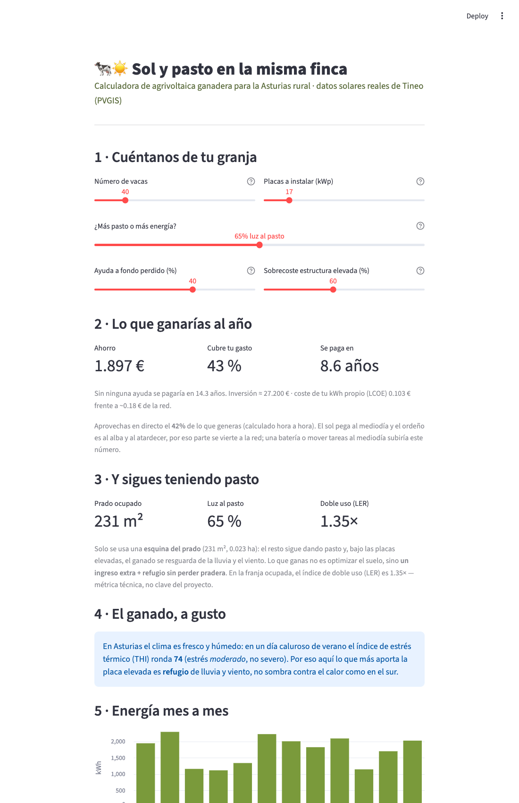

# 🐄☀️ Sol y pasto en la misma finca

**Calculadora de agrivoltaica ganadera para la Asturias rural.** Estima, para una granja de
vacuno concreta, cuánta energía produciría un sistema fotovoltaico elevado sobre el prado,
cuánto ahorraría, en cuántos años se pagaría y cuánta luz seguiría llegando al pasto — sin
retirar el suelo de la actividad ganadera.

Proyecto de respaldo para la idea de proyecto de las **Becas Excelencia de la Fundación Caja
Rural de Asturias** (reto de despoblación rural · modernización del sector primario).



## Qué hace, con rigor

- **Producción solar** con datos reales de **PVGIS v5.2** para cinco concejos ganaderos
  (Tineo, Cangas del Narcea, Somiedo, Teverga, Grado). Modelo físico POA→NOCT→γ→PR, de
  pérdidas coherente con PVGIS.
- **Doble uso del suelo**: reparto explícito de luz entre placa y pasto (GCR), índice LER.
- **Autoconsumo hora a hora**: cruza la generación solar con la curva real de ordeño
  (mañana/tarde) — aflora el desfase entre el sol del mediodía y el consumo de la granja.
- **Economía honesta**: ahorro, amortización y LCOE con precios citados (ES 2026). El
  sobrecoste de la estructura elevada se trata como **asunción ajustable**, no como dato.
- **Confort animal (THI)**: verifica que en el clima oceánico el beneficio es **refugio**,
  no sombra contra el calor.
- **Impacto de concejo**: escala el resultado a un escenario de adopción (energía limpia,
  CO₂ evitado con el factor de la red española, ahorro que queda en el territorio).
- **Informe imprimible** descargable.

## Honestidad por diseño

La herramienta no infla los números: muestra cuándo el sistema **no** se amortiza sin ayudas,
expone el desfase generación/ordeño, trata el sobrecoste de la estructura como incertidumbre
y etiqueta como escenario (no promesa) las cifras de adopción. Cada número lleva su fuente.

## Uso

```bash
python3 -m venv .venv
.venv/bin/pip install -r requirements-dev.txt
.venv/bin/streamlit run streamlit_app.py     # app en http://localhost:8501
.venv/bin/python -m pytest -q                 # 47 pruebas
```

## Estructura

```
app/core/    backbone puro y testeable (solar, agrivoltaic, perfil, economics, confort, impacto, informe)
app/ui/      vista Streamlit (accesible: español llano, texto grande, imprimible)
docs/        spec de diseño, bases de la convocatoria, idea de proyecto, build-log, capturas
tests/       47 pruebas guard (rango físico, coherencia PVGIS, honestidad del trade-off)
```

## Fuentes

PVGIS v5.2 (JRC) · consumo lácteo 516 kWh/vaca·año (estudio Castilla y León) · CAPEX FV
800–1.400 €/kWp (mercado ES 2026) · THI NRC 1971 · factor CO₂ red España 0,258 kg/kWh
(MITECO 2025) · nº de explotaciones de leche (estadística ganadera de Asturias).
